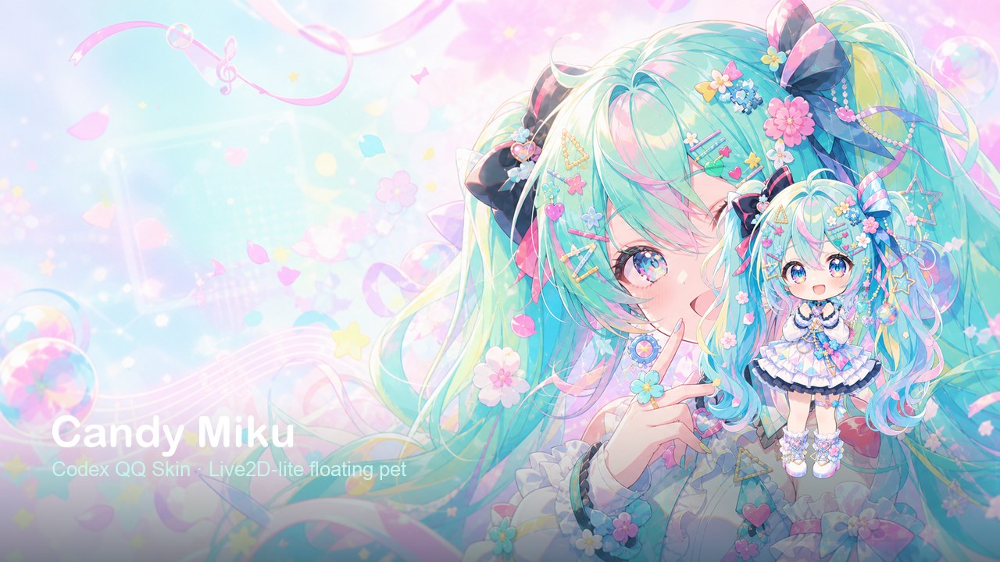
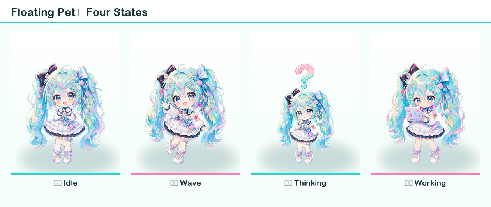
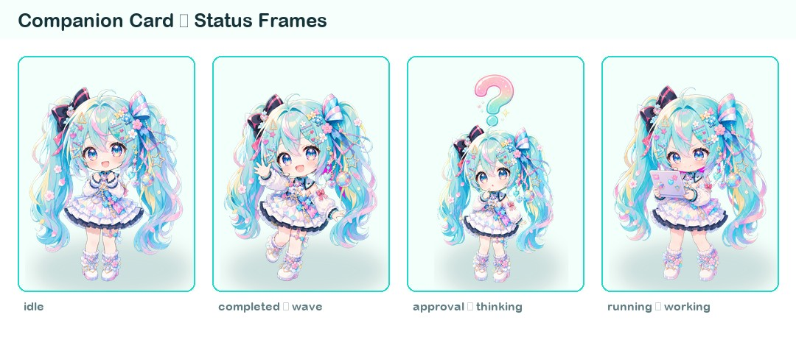
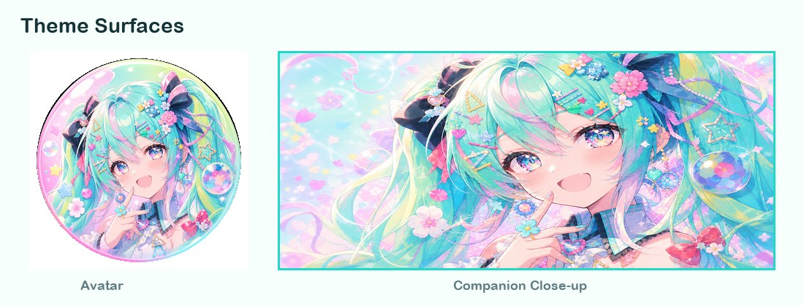

# Candy Miku

一套面向 [Codex QQ Skin](https://github.com/zhulin025/Codex-QQ-Skin) 的薄荷糖果色 Hatsune Miku 主题预设包。  
经典三栏 QQ 外框 + Live2D-lite 浮动宠物，随 Codex 任务状态自动切换姿态。

1、浅色 mint / pink candy 配色与三栏布局  
2、原生浮动宠物（整身抠图 + 胸腔枢轴呼吸 / 摇摆）  
3、四态姿态：`idle` / `wave` / `thinking` / `working`  
4、Companion 伙伴卡同步换帧  
5、完成 / 审批 / 上线音效  

> 非官方主题。与 Crypton、OpenAI、腾讯无关；不会修改官方 `.app`、`app.asar`、代码签名或 API Key。

| 字段 | 值 |
|------|-----|
| 主题 ID | `preset-candy-miku` |
| 显示名 | Candy Miku |
| 布局 | `classic-three-pane` |
| 外观 | light |

---

## 效果预览

### 主题总览

<p align="center">
  
</p>

### 浮动宠物 · 四态

随 Codex 任务状态切换；呼吸与摇摆由 canvas 实时驱动（无眨眼）。

<p align="center">
  
</p>

| 姿态 | 资产 | 对应 Codex 状态 |
|------|------|----------------|
| Idle | `miku-l2d-base.png` | `idle` / `offline` |
| Wave | `miku-l2d-wave.png` | `completed` |
| Thinking | `miku-l2d-thinking.png` | `approval` |
| Working | `miku-l2d-working.png` | `running` |

### Companion 卡片帧

右侧伙伴卡使用同一套状态映射：

<p align="center">
  
</p>

### 头像与伙伴特写

<p align="center">
  
</p>

---

## 启用

前提：已安装 [Codex QQ Skin](https://github.com/zhulin025/Codex-QQ-Skin)，且 Codex 至少成功启动过一次。

### 方式 A：克隆本仓库到 presets

```bash
cd /path/to/Codex-QQ-Skin/presets
git clone https://github.com/lost-tianyi/candy-miku-codex-qq-skin.git preset-candy-miku
cd ..
bash scripts/switch-theme-macos.sh --id preset-candy-miku
```

### 方式 B：若主题已在主仓库 presets 中

```bash
cd /path/to/Codex-QQ-Skin
bash scripts/switch-theme-macos.sh --id preset-candy-miku
```

仅刷新主题目录、暂不切换外观：

```bash
bash scripts/switch-theme-macos.sh --id preset-candy-miku --no-apply
```

开发热注入（可选）：

```bash
node scripts/injector.mjs --watch --port 9341 \
  --theme-dir "$HOME/Library/Application Support/CodexQQSkin/theme"
```

在 Codex 中点击「打开宠物」即可看到浮动 Miku。

### 调试姿态

在宠物 overlay 页控制台：

```js
window.__QQ_SKIN_AVATAR_OVERLAY__.setStatus('running')   // → working
window.__QQ_SKIN_AVATAR_OVERLAY__.setStatus('approval')  // → thinking
window.__QQ_SKIN_AVATAR_OVERLAY__.setStatus('completed') // → wave
window.__QQ_SKIN_AVATAR_OVERLAY__.setStatus('idle')
window.__QQ_SKIN_AVATAR_OVERLAY__.getDebugState()
```

---

## 功能说明

- **Live2D-lite**：每态一张完整抠图，共享胸腔枢轴做微动；已关闭眨眼与硬分割图层，避免接缝与鬼影。
- **状态绑定**：主窗口写入 `localStorage` 键 `codex-qq-skin-pet-status`，并通过 `BroadcastChannel("codex-qq-skin-pet")` 广播；overlay 轮询并切换姿态。
- **声音**：完成 `cough`、审批 `alert`、上线 `knock`（见 `theme.json` → `sound`）。
- **配色**：主色 `#22D8C8`，糖果粉 `#FF79B8`，背景 `#F7FFFC`。

运行时注入逻辑在仓库根目录：

- `assets/avatar-overlay-inject.js` — 浮动宠物 canvas / 状态切换  
- `assets/renderer-inject.js` — companion 状态写出与广播  

---

## 目录结构

```text
preset-candy-miku/
├── README.md
├── theme.json                 # 主题入口
├── overlay-live2d.json        # Live2D-lite 元数据（由脚本同步）
├── background.png
├── avatar.png
├── companion-closeup.png
├── miku-overlay-idle.png      # overlay 回退静图
├── miku-l2d-*.png             # 浮动宠物四态
├── miku-pet-*.png             # companion 四态帧
├── sources/                   # 重建用抠图源
├── scripts/
│   └── make-live2d-layers.py
└── docs/previews/             # 本文档预览图
```

---

## 重建 Live2D 画布

修改 `sources/{idle,wave,thinking,working}.png` 后执行：

```bash
cd presets/preset-candy-miku
python3 scripts/make-live2d-layers.py
```

脚本会生成 `miku-l2d-*.png`、`miku-overlay-idle.png`，并同步 `theme.json` / `overlay-live2d.json`（`defaultState` 固定为 `idle`）。

依赖：`Pillow`、`numpy`。

---

## 设计取舍

以下方案已验证后放弃，中间产物已清理：

| 方案 | 结果 |
|------|------|
| 多 PNG 翻页动画 | 接缝 / 残影 |
| 图转视频驱动 | 体积与同步成本过高 |
| 头发 / 身体 / 头硬分割 | 接缝明显 |
| 程序化眨眼 + 刘海遮挡 | 观感不佳（已关闭） |

当前方案：**整身抠图 + 共享胸腔枢轴微动 + 按状态换底图**。

---

## 素材与商标

Hatsune Miku / 初音未来等相关形象权利归 Crypton Future Media 等权利人所有。本主题仅作 Codex QQ Skin 的非官方外观示例。
