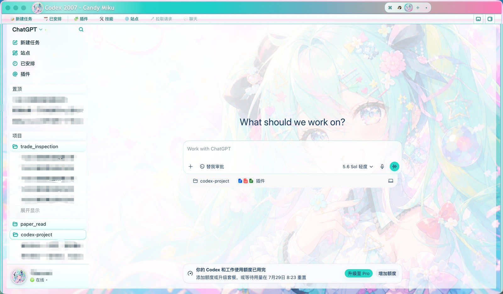
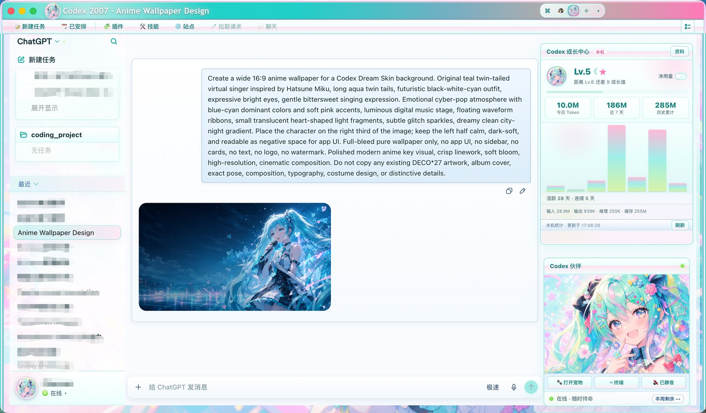

# Candy Miku

薄荷糖果色 Hatsune Miku 主题预设，用于 [Codex QQ Skin](https://github.com/zhulin025/Codex-QQ-Skin)。

- 经典三栏 QQ 外框 + mint / pink candy 配色  
- Companion 伙伴卡使用**特写大图**（`companion-closeup.png`）  
- 「打开宠物」浮动 overlay 使用 **Q 版 Live2D-lite** 四态  
- 完成 / 审批 / 上线音效  

> 非官方主题。与 Crypton、OpenAI、腾讯无关。需要先安装 Codex QQ Skin。

| 字段 | 值 |
|------|-----|
| 主题 ID | `preset-candy-miku` |
| 显示名 | Candy Miku |
| 布局 | `classic-three-pane` |
| 皮肤模式 | `miku` |

---

## 效果预览

### 新建任务

<p align="center">
  
</p>

### 聊天界面

右侧同时展示 Codex 成长中心与 Codex 伙伴；可通过「打开宠物」唤出浮动宠物。

<p align="center">
  
</p>

---

## 特性介绍

Candy Miku 运行在 Codex QQ Skin 之上，右侧栏会启用三组特色能力：

### Codex 成长中心

- 读取本机 Codex 用量（今日 / 近 7 天 / 历史累计），并展示七日趋势图。  
- 按活跃日与用量档位计算成长值，以 QQ 经典的星、月、日、冠显示等级。  
- 支持「总用量 / 净用量」切换；数据只留在本机，不上传 prompt 或 API Key。  
- 点击「资料」可回到 Codex 原生输出/来源面板，再点「成长统计」返回。

### Codex 伙伴

- 右侧固定伙伴卡，Candy Miku 使用 `companion-closeup.png` **特写大图**（非 Q 版）。  
- 显示在线状态文案，并提供快捷操作：打开宠物、终端、声音开关。  
- 任务状态变化时会更新状态文案与音效；伙伴主图保持特写，不随 Q 版帧切换。

### Codex 宠物

- 点击伙伴卡「打开宠物」打开原生浮动窗口。  
- 使用 Q 版 Live2D-lite：整身抠图 + 胸腔枢轴呼吸 / 摇摆（无眨眼）。  
- 随 Codex 任务状态自动换姿：

| 姿态 | Codex 状态 | 资产 |
|------|------------|------|
| Idle | `idle` / `offline` | `miku-l2d-base.png` |
| Wave | `completed` | `miku-l2d-wave.png` |
| Thinking | `approval` | `miku-l2d-thinking.png` |
| Working | `running` | `miku-l2d-working.png` |

---

## 启动方法

### 方式 A：双击启动脚本（推荐）

1. 先安装 [Codex QQ Skin](https://github.com/zhulin025/Codex-QQ-Skin)，并确保 Codex 至少成功启动过一次。  
2. 克隆本仓库：

```bash
git clone https://github.com/lost-tianyi/candy-miku-codex-qq-skin.git
cd candy-miku-codex-qq-skin
```

3. 双击 **`Start Candy Miku.command`**  
   或在终端执行：

```bash
chmod +x "Start Candy Miku.command" scripts/start-candy-miku-macos.sh
./scripts/start-candy-miku-macos.sh
```

脚本会：

1. 把主题安装到 `~/Library/Application Support/CodexQQSkin/themes/preset-candy-miku`  
2. 同步到本机 Codex QQ Skin 的 `presets/`（若找得到）  
3. 调用 `switch-theme-macos.sh --id preset-candy-miku`（`miku` 模式）启动  

若 QQ Skin 不在默认路径，可手动指定：

```bash
export CODEX_QQ_SKIN_ROOT="/path/to/Codex-QQ-Skin"
./scripts/start-candy-miku-macos.sh
```

### 方式 B：放进 QQ Skin 的 presets 后切换

```bash
cd /path/to/Codex-QQ-Skin/presets
git clone https://github.com/lost-tianyi/candy-miku-codex-qq-skin.git preset-candy-miku
cd ..
bash scripts/switch-theme-macos.sh --id preset-candy-miku
```

### 方式 C：已在主仓库内置时

若 `Codex-QQ-Skin/presets/preset-candy-miku` 已存在：

```bash
cd /path/to/Codex-QQ-Skin
bash scripts/switch-theme-macos.sh --id preset-candy-miku
```

或使用桌面启动器（若已创建）：`启动 Candy Miku.command`。

---

## 使用说明

1. 启动后 Codex 右侧应出现 **成长中心** 与 **Candy Miku Companion 特写**。  
2. 点击「打开宠物」打开 **Q 版浮动宠物**。  
3. 任务 `running` / `approval` / `completed` 时，浮动宠物会切换姿态；Companion 卡保持特写不变。  

调试（在宠物 overlay 控制台）：

```js
window.__CODEX_QQ_SKIN_AVATAR_OVERLAY__.setStatus('running')
window.__CODEX_QQ_SKIN_AVATAR_OVERLAY__.setStatus('idle')
window.__CODEX_QQ_SKIN_AVATAR_OVERLAY__.getDebugState()
```

---

## 目录结构

```text
candy-miku-codex-qq-skin/
├── Start Candy Miku.command          # 一键启动
├── scripts/
│   ├── start-candy-miku-macos.sh     # 安装主题并启动
│   └── make-live2d-layers.py         # 从 sources/ 重建 Q 版画布
├── theme.json
├── background.png / avatar.png
├── companion-closeup.png             # Companion 特写（非 Q 版）
├── miku-overlay-idle.png
├── miku-l2d-*.png                    # 浮动宠物 Q 版四态
├── miku-pet-*.png                    # Q 版备份素材（不用于 Companion）
├── sources/                          # 重建源图
└── docs/previews/                    # Codex 实机预览图
```

---

## 重建 Q 版 Live2D 画布

```bash
python3 scripts/make-live2d-layers.py
```

依赖：`Pillow`、`numpy`。`defaultState` 固定为 `idle`。

---

## 素材与商标

Hatsune Miku / 初音未来等相关形象权利归 Crypton Future Media 等权利人所有。本主题仅作 Codex QQ Skin 的非官方外观示例。

---

## Star History

[](https://www.star-history.com/#lost-tianyi/candy-miku-codex-qq-skin&Date)
